# mall-swarm

## 项目介绍

`mall-swarm`是一套微服务商城系统，采用了 Spring Cloud、Spring Boot、MyBatis、reids、Elasticsearch、Docker、Kubernetes等核心技术，同时提供了基于Vue的管理后台方便快速搭建系统。`mall-swarm`在电商业务的基础集成了注册中心、配置中心、监控中心、网关等系统功能。

## 系统架构图


## 组织结构

``` lua
mall
├── mall-common -- 工具类及通用代码模块
├── mall-mbg -- MyBatisGenerator生成的数据库操作代码模块
├── mall-auth -- 基于Spring Security Oauth2的统一的认证中心
├── mall-gateway -- 基于Spring Cloud Gateway的微服务API网关服务
├── mall-monitor -- 基于Spring Boot Admin的微服务监控中心
├── mall-admin -- 后台管理系统服务
├── mall-search -- 基于Elasticsearch的商品搜索系统服务
├── mall-portal -- 移动端商城系统服务
├── mall-demo -- 微服务远程调用测试服务
└── config -- 配置中心存储的配置
```


## 技术选型

### 后端技术

| 技术                   | 说明                 | 官网                                                 |
| ---------------------- | -------------------- | ---------------------------------------------------- |
| Spring Cloud           | 微服务框架           | https://spring.io/projects/spring-cloud              |
| Spring Boot            | 容器+MVC框架         | https://spring.io/projects/spring-boot               |
| Spring Security Oauth2 | 认证和授权框架       | https://spring.io/projects/spring-security-oauth     |
| MyBatis                | ORM框架              | http://www.mybatis.org/mybatis-3/zh/index.html       |
| MyBatisGenerator       | 数据层代码生成       | http://www.mybatis.org/generator/index.html          |
| PageHelper             | MyBatis物理分页插件  | http://git.oschina.net/free/Mybatis_PageHelper       |
| Elasticsearch          | 搜索引擎             | https://github.com/elastic/elasticsearch             |
| RabbitMq               | 消息队列             | https://www.rabbitmq.com/                            |
| Redis                  | 分布式缓存           | https://redis.io/                                    |
| MongoDb                | NoSql数据库          | https://www.mongodb.com/                             |
| Docker                 | 应用容器引擎         | https://www.docker.com/                              |
| Druid                  | 数据库连接池         | https://github.com/alibaba/druid                     |
| MinIO                  | 对象存储             | https://github.com/minio/minio                       |
| JWT                    | JWT登录支持          | https://github.com/jwtk/jjwt                         |
| LogStash               | 日志收集             | https://github.com/logstash/logstash-logback-encoder |
| Lombok                 | 简化对象封装工具     | https://github.com/rzwitserloot/lombok               |
| Seata                  | 全局事务管理框架     | https://github.com/seata/seata                       |
| Portainer              | 可视化Docker容器管理 | https://github.com/portainer/portainer               |

[//]: # (| Jenkins                | 自动化部署工具       | https://github.com/jenkinsci/jenkins                 |)

[//]: # (| Kubernetes             | 应用容器管理平台     | https://kubernetes.io/                               |)

### 前端技术

| 技术       | 说明                  | 官网                           |
| ---------- | --------------------- | ------------------------------ |
| Vue        | 前端框架              | https://vuejs.org/             |
| Vue-router | 路由框架              | https://router.vuejs.org/      |
| Vuex       | 全局状态管理框架      | https://vuex.vuejs.org/        |
| Element    | 前端UI框架            | https://element.eleme.io/      |
| Axios      | 前端HTTP框架          | https://github.com/axios/axios |
| v-charts   | 基于Echarts的图表框架 | https://v-charts.js.org/       |


## 环境搭建

### 开发环境

| 工具          | 版本号 | 下载                                                         |
| ------------- | ------ | ------------------------------------------------------------ |
| JDK           | 1.8    | https://www.oracle.com/technetwork/java/javase/downloads/jdk8-downloads-2133151.html |
| Mysql         | 5.7    | https://www.mysql.com/                                       |
| Redis         | 7.0    | https://redis.io/download                                    |
| Elasticsearch | 7.17.3 | https://www.elastic.co/cn/downloads/elasticsearch            |
| Kibana        | 7.17.3 | https://www.elastic.co/cn/downloads/kibana                   |
| Logstash      | 7.17.3 | https://www.elastic.co/cn/downloads/logstash                 |
| MongoDb       | 5.0    | https://www.mongodb.com/download-center                      |
| RabbitMq      | 3.10.5 | http://www.rabbitmq.com/download.html                        |
| nginx         | 1.22   | http://nginx.org/en/download.html                            |


## redis-cluster（3主3从）
##### 1. 拉取镜像
docker pull redis:7.0
##### 2. 机器上进行部署
机器1：192.168.244.129

机器2：192.168.244.130

机器3：192.168.244.131

docker run -itd -p 6379:6379  -p 16379:16379  --name redis-6379 --restart=always  -v /data/redis-6379/conf/redis.conf:/usr/local/etc/redis/redis.conf   -v /data/redis-6379/data:/usr/local/etc/redis/data/  redis:7.0 redis-server /usr/local/etc/redis/redis.conf

docker run -itd -p 6378:6378 -p 16378:16378 --name redis-6378 --restart=always  -v /data/redis-6378/conf/redis.conf:/usr/local/etc/redis/redis.conf  -v /data/redis-6378/data:/usr/local/etc/redis/data/   redis:7.0 redis-server /usr/local/etc/redis/redis.conf

##### 3. 构建集群（3主3从）
*在任意容器内都可执行*

redis-cli --cluster create 192.168.244.129:6379  192.168.244.129:6378  192.168.244.130:6379  192.168.244.130:6378 192.168.244.131:6379  192.168.244.131:6378 --cluster-replicas 1

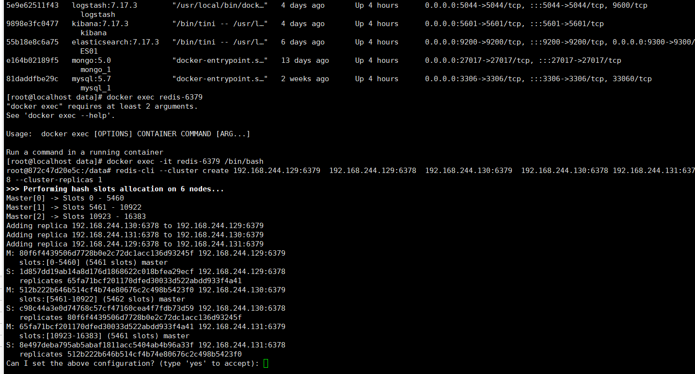

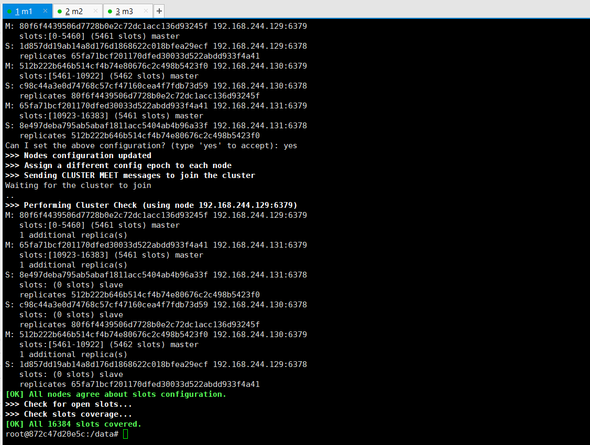

## Elasticsearch集群

##### 0.拉取镜像
docker pull elasticsearch:7.17.3

##### 1.创建挂载目录

[data:存放索引数据，plugins:存放es插件]

sudo mkdir -p  /data/elasticsearch/data

sudo mkdir -p  /data/elasticsearch/plugins

##### 2.设置执行权限

sudo chmod 777 /data/elasticsearch/

##### 3.更改系统配置

sudo vi /etc/sysctl.conf

vm.max_map_count=262145

配置改完刷新

sysctl -p

##### 4.配置文件


##### 5.安装中文分词器

https://github.com/medcl/elasticsearch-analysis-ik/releases/download/v7.17.3/elasticsearch-analysis-ik-7.17.3.zip

unzip  elasticsearch-analysis-ik-7.17.3.zip -d /data/elasticsearch/plugins/ik/

##### 6.运行es

docker run -itd --name ES01  -p 9200:9200 -p 9300:9300  --restart=always  -e ES_JAVA_OPTS="-Xms256m -Xmx256m" -v /data/elasticsearch/config/elasticsearch.yml:/usr/share/elasticsearch/config/elasticsearch.yml -v /data/elasticsearch/data/:/usr/share/elasticsearch/data/ -v /data/elasticsearch/plugins/:/usr/share/elasticsearch/plugins elasticsearch:7.17.3

## ELK
### 1.kibana
##### 1.1 配置文件
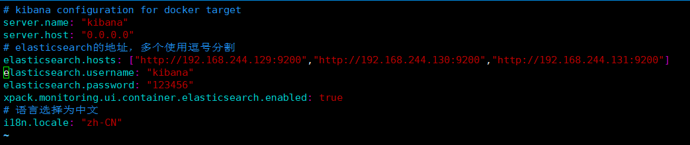
##### 1.2 运行容器
docker run -itd --name kibana -p 5601:5601 --restart=always -v /data/kibana/config/kibana.yml:/usr/share/kibana/config/kibana.yml  kibana:7.17.3

### 2. logstash
##### 2.1 配置文件
logstash.yml
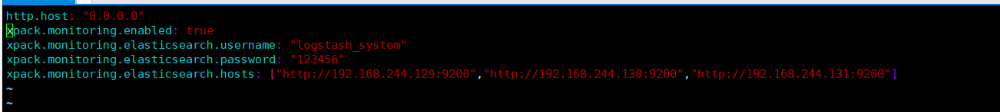

logstash.conf
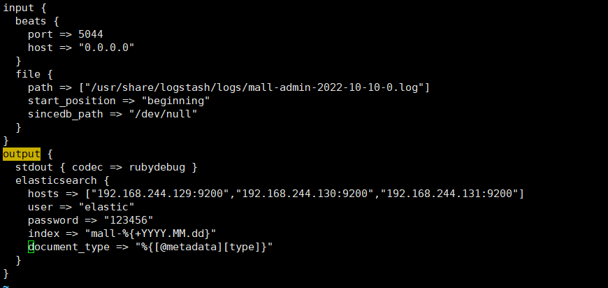
##### 2.2 运行容器
docker run -itd --name logstash -p 5044:5044 -p 5000:5000  --restart=always -e LS_JAVA_OPTS="-Duser.timezone=GMT+08" -v /etc/timezone:/etc/timezone:ro -v /etc/localtime:/etc/localtime:ro -v /data/filebeat/logs/:/usr/share/logstash/logs/ -v /data/logstash/config/logstash.conf:/usr/share/logstash/config/logstash.conf  -v  /data/logstash/config/logstash.yml:/usr/share/logstash/config/logstash.yml  -v  /data/logstash/config/jvm.options:/usr/share/logstash/config/jvm.options logstash:7.17.3

### 3. filebeat
##### 3.1 配置文件
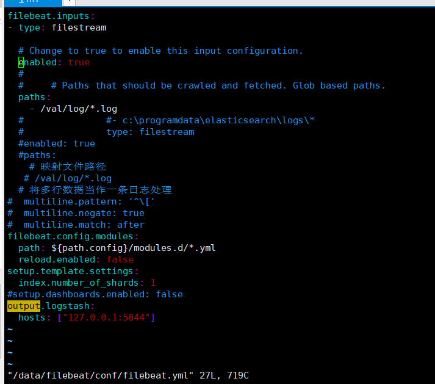

##### 3.2 运行容器
docker run -itd --name filebeat  --restart=always -v /var/lib/docker/containers:/var/lib/docker/containers:ro -v /etc/timezone:/etc/timezone:ro -v /etc/localtime:/etc/localtime:ro -v /data/filebeat/logs/:/var/log/:ro -v /data/filebeat/conf/filebeat.yml:/usr/share/filebeat/filebeat.yml  docker.elastic.co/beats/filebeat:7.17.3


## 运行效果展示

- 查看注册中心注册服务信息，访问地址：http://192.168.244.131:8848/nacos/
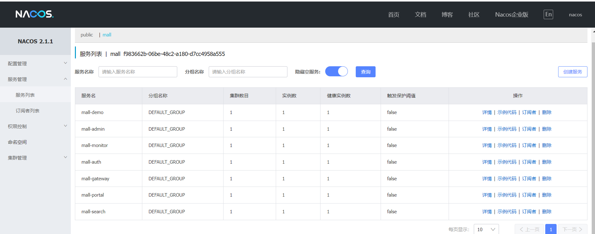


- 监控中心应用信息，访问地址：http://127.0.0.1:8101
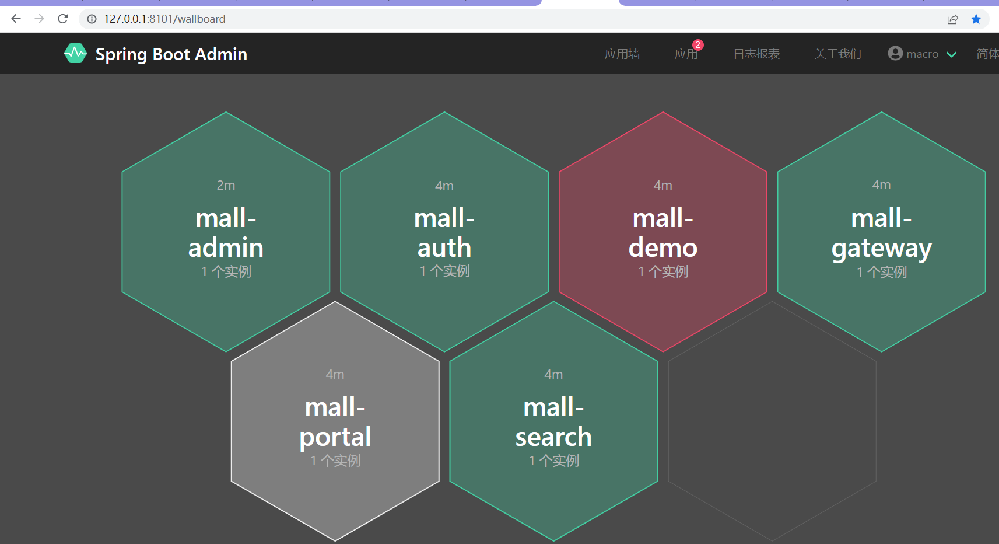

  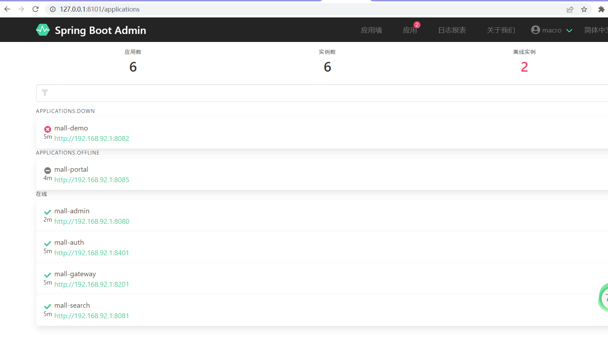


- ELK日志收集系统信息，访问地址：http://192.168.244.129:5601
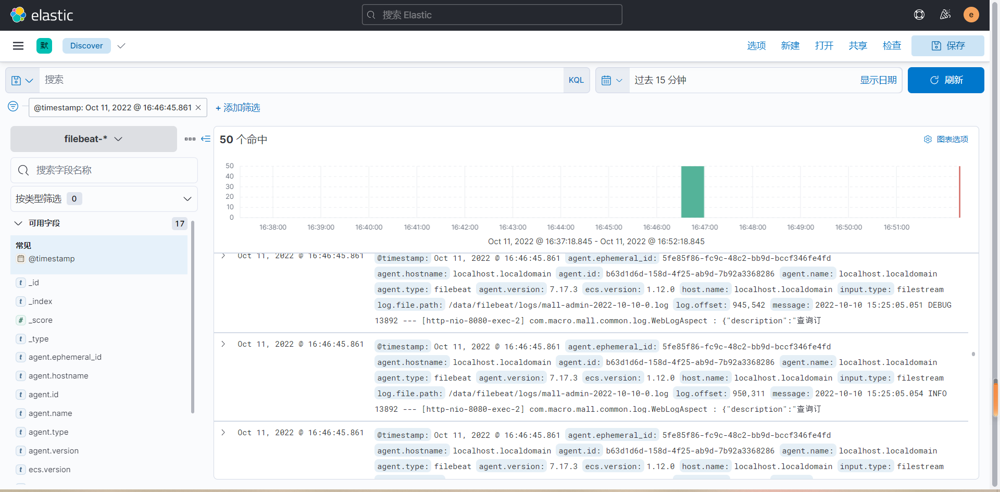

- 可视化容器管理，访问地址：http://192.168.244.128:9000
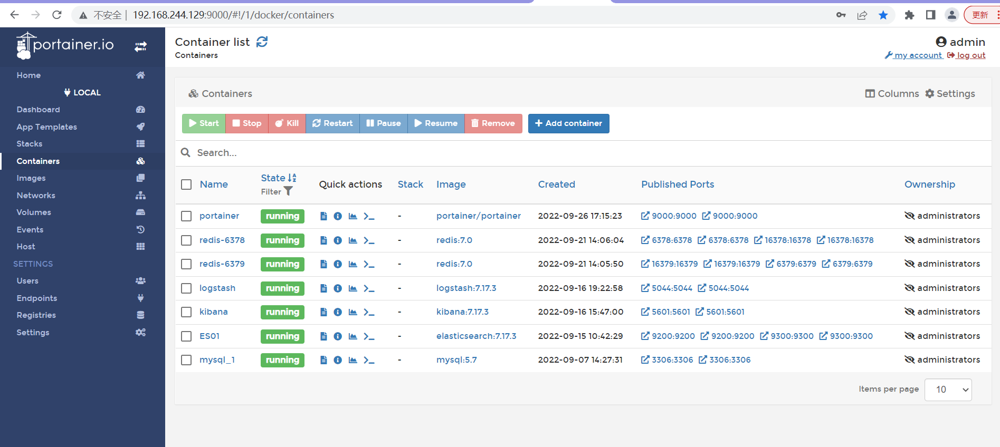

    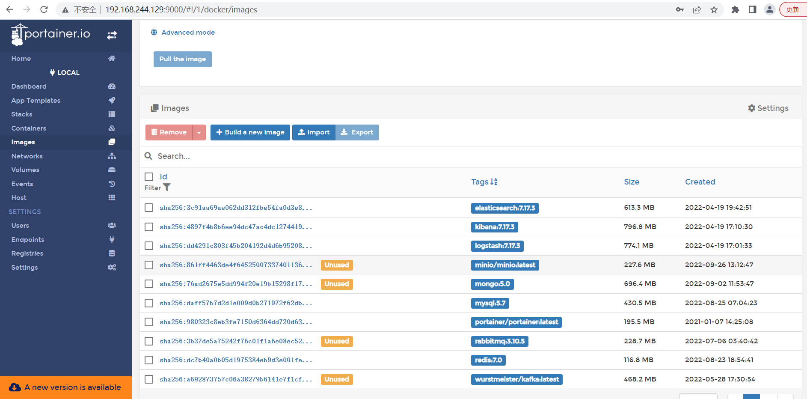


- 对象存储，访问地址：http://192.168.244.130:9002
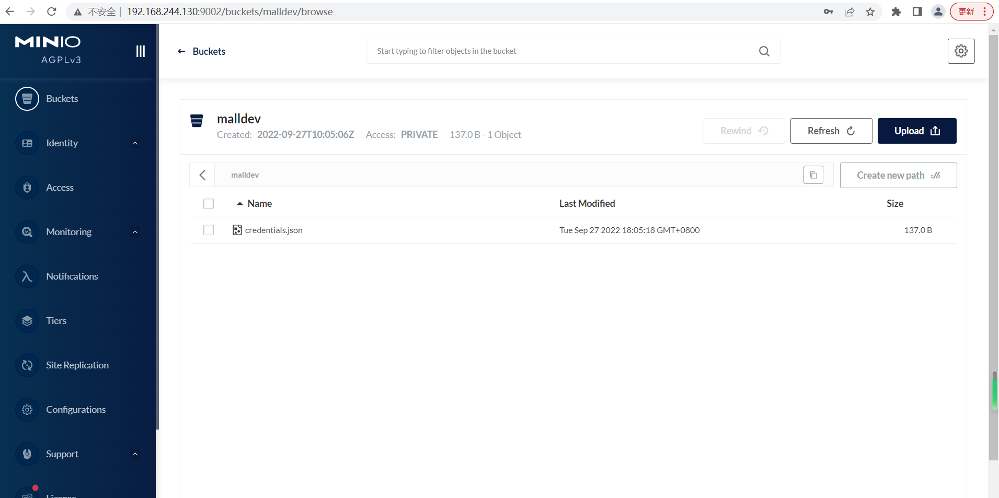


- Elasticsearch集群，访问地址：es-header
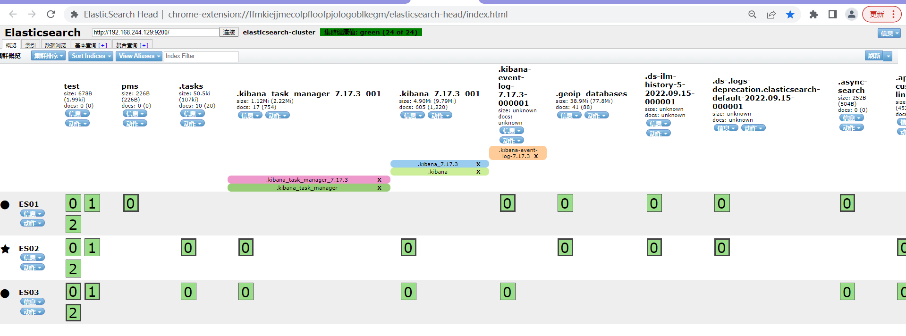


- cluster info查看redis集群信息
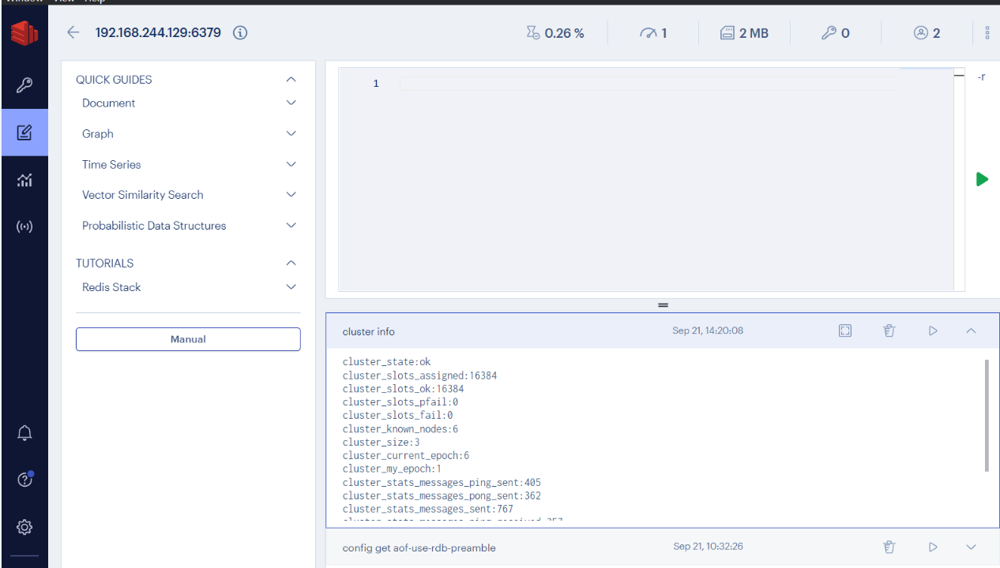
